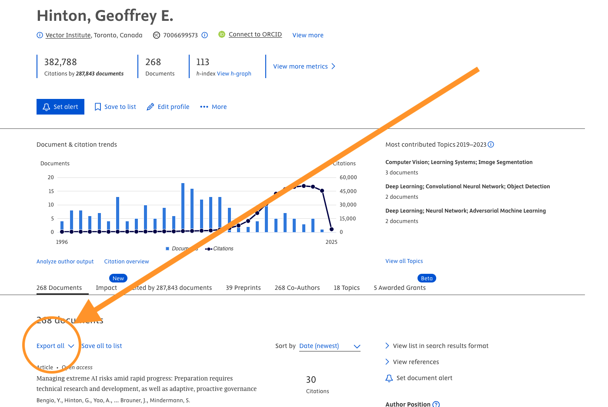
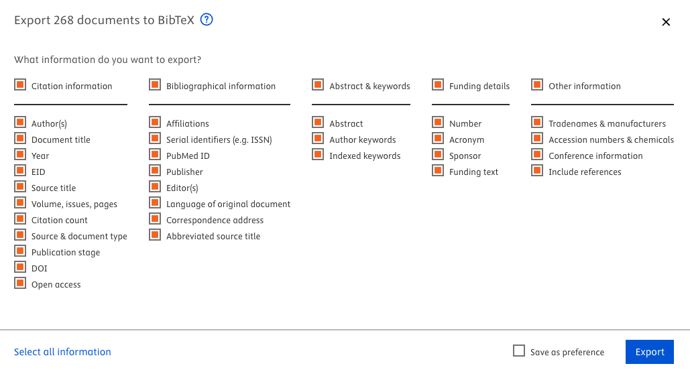

# Researcher Contribution and Citation Analysis from BibTeX

This Python script analyzes an author's publications from a BibTeX file and computes various metrics to reflect their contribution and impact in research. The script also extracts citation counts from the `note` field in the BibTeX entries (only available in bibtex files exported from Scopus Profiles) and calculates a **weighted contribution score** based on the author's role in each paper and the number of citations.

##  **Features**
- Calculates the **average number of authors per paper**.
- Determines the **author's position** in each paper (e.g., 1st, 2nd, last).
- Extracts the **number of citations** from the `note` section of BibTeX entries.
- Computes the **contribution score** based on the author's role in each paper (first, middle, or last author).
- Computes a **weighted contribution score** that multiplies the author's contribution score by the number of citations for each paper.

---

## **How to Use**
1. Export the author's publications as a **BibTeX file** from Scopus or any reference manager.
2. Save the BibTeX file as `publications.bib` in the same directory as the script.
3. Run the script with Python:

```bash
python3 bibtex_stats.py
```

4. Enter the author's **last name** when prompted.

---

## 📐 **Metrics Explained**

### 1. **Contribution Score**
The **Contribution Score** reflects the author's role in each paper. It assigns more weight to first and last authorship, while middle authors get a smaller share of credit depending on the number of authors.

The formula is:

$$
\text{Contribution Score} =
\begin{cases}
w_1 \times \frac{1}{\sqrt{\text{Number of Authors}}}, & \text{if First Author} \\
w_n \times \frac{1}{\sqrt{\text{Number of Authors}}}, & \text{if Last Author} \\
\frac{w_m}{\text{Number of Authors}}, & \text{if Middle Author} \\
0, & \text{if Not an Author}
\end{cases}
$$


Where:
- $w_1 = 0.6$ is the weight for **first authorship**.
- $w_n = 0.4$ is the weight for **last authorship**.
- $w_m = 1.0$ is the weight for **middle authorship**.

---

### 2. **Weighted Contribution Score**
The **Weighted Contribution Score** measures the author's **impact** by multiplying their **Contribution Score** by the **number of citations** for each paper.

The formula is:

$$
\text{Weighted Contribution Score} = \sum_{i=1}^{N} (\text{Contribution Score}_i \times \text{Citations}_i)
$$

Where:
- $N$ is the number of papers.
- $\text{Contribution Score}_i $ is the author's contribution score for paper $ i $.
- $\text{Citations}_i$ is the number of citations for paper $ i $.

---

### 3. **Additional Metrics in the Summary Table**
| Metric                                     | Description                                                |
|--------------------------------------------|------------------------------------------------------------|
| **Average Number of Authors per Paper**     | Average number of authors across all papers.               |
| **Total Number of Papers**                 | Total number of papers in the BibTeX file.                 |
| **Number of First-Author Papers**           | Number of papers where the target author is the first author. |
| **Number of Last-Author Papers**            | Number of papers where the target author is the last author. |
| **Number of Middle-Author Papers**          | Number of papers where the target author is a middle author. |
| **Total Contribution Score**                | Sum of the contribution scores across all papers.           |
| **Average Contribution Score**              | Average contribution score across all papers.               |
| **Weighted Contribution Score**             | Total impact score based on contribution and citation count. |

---

## **Handling Citations from BibTeX**
The script looks for citation counts in the **`note` field** of each BibTeX entry. Specifically, it extracts the number of citations from text like:

```
note = {Cited by: 15; Conference name: ...}
```

### ⚠️ **Important Note:**
- If you export the BibTeX file from **Scopus**, the citation counts will be included in the `note` field.
- If the `note` field is missing or does not contain the **"Cited by"** information, the script will set the citation count to **N/A** for that paper.
- You can extract a BibTeX file of a researcher's publications from Scopus as shown in the images below:
 
 


---

##  **Example Output**

### **Table of Papers with Author Analysis:**
| Title                                   | Number of Authors | Author Position | Citations | Contribution Score |
|-----------------------------------------|-------------------|-----------------|-----------|--------------------|
| Resource Allocation in 5G Networks      | 3                 | 1               | 15        | 0.35               |
| A Survey on Machine Learning            | 4                 | 2               | N/A       | 0.25               |
| Deep Reinforcement Learning for 6G      | 6                 | 4               | 8         | 0.20               |

### **Summary Table:**
| Metric                                     | Value   |
|--------------------------------------------|---------|
| Average Number of Authors per Paper        | 4.25    |
| Total Number of Papers                     | 10      |
| Number of First-Author Papers              | 3       |
| Number of Last-Author Papers               | 2       |
| Number of Middle-Author Papers             | 5       |
| Total Contribution Score                   | 5.70    |
| Average Contribution Score                 | 0.57    |
| Weighted Contribution Score (Contribution $\times$ Citations) | 114.20 |

---

## 🤝 **Contributing**
If you'd like to contribute to this project, feel free to submit a **pull request** or **open an issue** on GitHub.

---

## 📄 **License**
This project is licensed under the **MIT License**. See the `LICENSE` file for more details.

---

## 📧 **Contact**
If you have any questions or suggestions, feel free to reach out to nima.afraz@ucd.ie!

